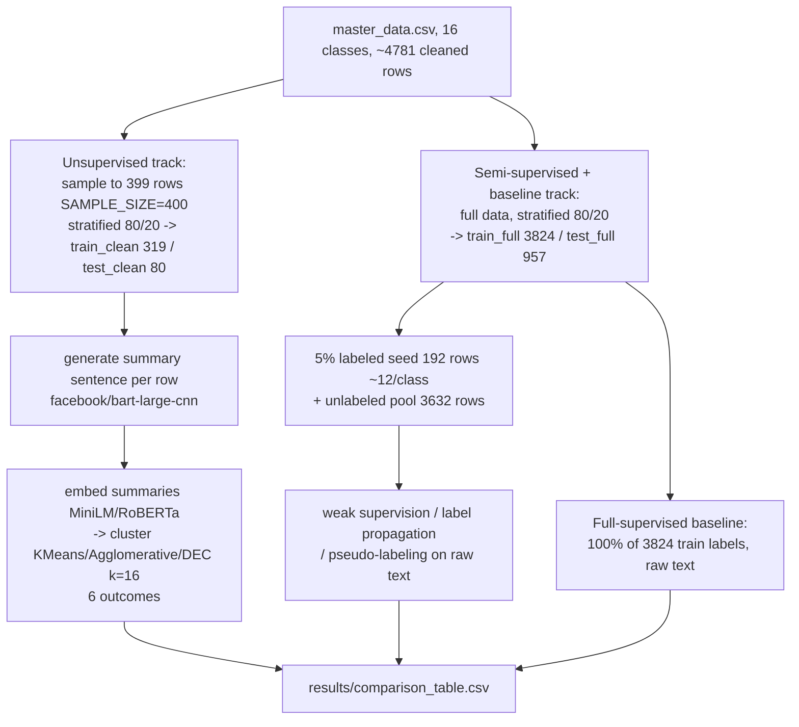
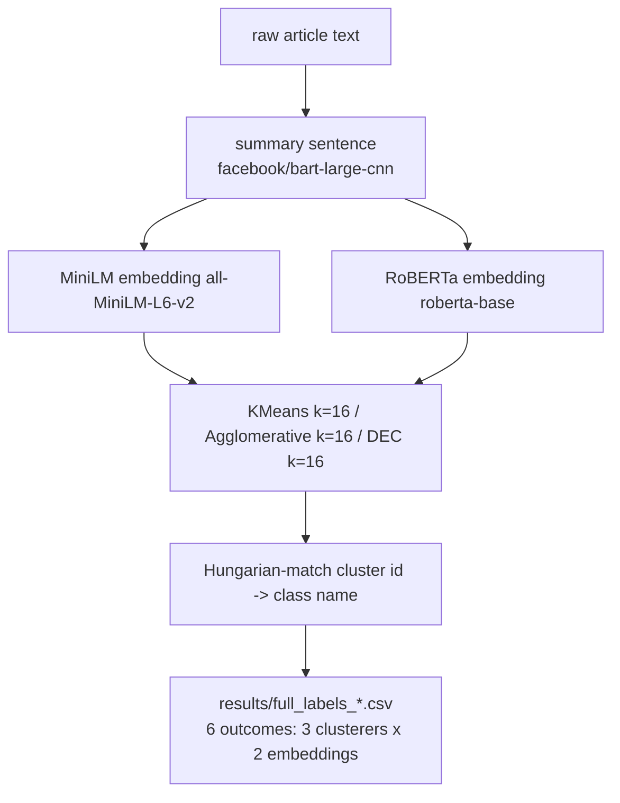
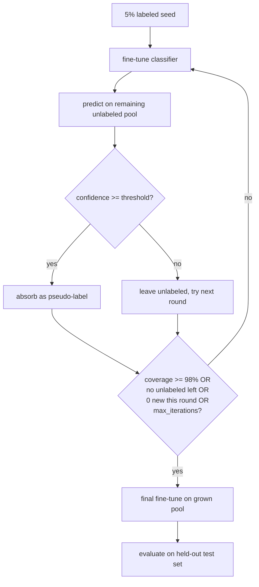

# Auto-Labeling for Text Classification — Master Data (16 Classes)

**Project summary for presentation**
Date: 2026-09-06 (full-scale semi-supervised re-run)

> The AG News (4-class) version of this project has been retired and is
> archived at [`docs/PROJECT_SUMMARY_AGNEWS_ARCHIVE.md`](docs/PROJECT_SUMMARY_AGNEWS_ARCHIVE.md)
> for historical reference. This document describes the current,
> `data/master_data.csv`-based rebuild.

## 1. Goal

Automatically assign category labels to a corpus of news/opinion articles
**without full human annotation**, and compare how far unsupervised
clustering, weak supervision, label propagation, pseudo-labeling
(self-training), and a full-supervised baseline each get toward that goal —
now across **16 overlapping categories** instead of AG News's 4 clean,
well-separated ones.

## 2. Dataset

`data/master_data.csv` — 4,800 rows (300/class), built from `data/raw/`
sources (`bbc-text.csv`, `CNN_Articels_clean` / `CNN_Articels_clean_2`,
`news-article-categories.csv`) via `notebooks/00_data_transform.ipynb`, with
columns `category, title, summary, text` (the source `summary` column is
**dropped** during cleaning — patchy/missing across source files; a fresh
`summary` is generated later by the pipeline itself, see below).

**16 classes** (alphabetical, so the label↔index mapping in `utils/config.py`
is deterministic and independent of CSV row order):

ARTS & CULTURE, BUSINESS, COMEDY, CRIME, EDUCATION, ENTERTAINMENT,
ENVIRONMENT, HEALTH, MEDIA, NEWS, POLITICS, RELIGION, SCIENCE, SPORTS,
TECH, WOMEN.

Several of these overlap in subject matter (POLITICS vs. NEWS vs. WOMEN vs.
CRIME vs. MEDIA can all plausibly describe the same story), which turns out
to matter a great deal for the semi-supervised results below.

**Cleaning**: dedup, drop degenerate rows (body under `MIN_WORDS=5`, e.g. a
body that is just `"(CNN)"`), leaving ~4,781 rows.

**Dual-split design (as of the 2026-09-06 full-scale re-run).** The
pipeline now maintains two separate splits:

- **Unsupervised track** (notebooks 01–02): a **summarized / capped** split
  (`train_clean` / `test_clean`, 399 rows) driven by `SAMPLE_SIZE=400`.
  Summarization via `facebook/bart-large-cnn` is slow on CPU; these results
  are already committed and were **not** re-run.
- **Semi-supervised + baseline track** (notebooks 04–08): a **full-scale**
  split built directly from the cleaned ~4,781-row corpus — no sampling cap,
  no summarization needed since all methods train on raw text.

The three successive scope reductions (4,781 → 1,600 → 800 → 399 rows)
that formerly applied to every notebook now apply **only** to the
unsupervised track. This matters enormously for the semi-supervised results:
the thin 1-per-class seed that caused pseudo-labeling to stall and weak
supervision to collapse to chance was a consequence of those scope
reductions, not an inherent limitation of these methods at this dataset size.

**Full-scale split** (semi-supervised + baseline track, from
`data/processed/*_full.parquet`):
- Stratified 80/20 train/test of all ~4,781 cleaned rows →
  **3,824 train / 957 test** (approximately 239 per class per split).
- `LABEL_FRACTION=0.05` of 3,824 train rows →
  **192 labeled rows — ~12 per class** (`labeled_full.parquet`),
  unlabeled pool = **3,632 rows** (`unlabeled_full.parquet`).

**Capped split** (unsupervised track only, unchanged from prior run):
- 399 rows (SAMPLE_SIZE=400, stratified), **319 train / 80 test**,
  **16 labeled rows — 1 per class**.

## 3. Pipeline / Data Flow

### 3.1 Overall pipeline



### 3.2 Unsupervised summary → cluster → name flow



### 3.3 Pseudo-labeling self-training loop (DistilBERT and ELECTRA-small both follow this shape)



As Section 6 shows, both models hit the `0 new this round` stop condition
on **iteration 0** every single attempt — the loop above never gets past
its first pass through the top branch for either model at this seed size.

## 4. Approaches

### 4.1 Unsupervised clustering (`01_embeddings.ipynb`, `02_unsupervised_clustering.ipynb`)

Every row's `text` is summarized into a real sentence (not keywords) with
`facebook/bart-large-cnn`, then that **summary** (not the raw text) is
embedded two ways — MiniLM (`all-MiniLM-L6-v2`, 384-dim) and RoBERTa
(`roberta-base`, 768-dim) — and clustered with three algorithms, all
requiring explicit k=16:

- **KMeans** (`sklearn.cluster.KMeans`, n_init=10): runs on
  UMAP(n_components=50)-reduced embeddings. Standard baseline.
- **Agglomerative Clustering** (`sklearn.cluster.AgglomerativeClustering`,
  ward linkage): hierarchical bottom-up clustering on UMAP-reduced
  embeddings. Ward linkage minimises within-cluster variance at each merge.
- **DEC** (Deep Embedded Clustering, Xie et al. 2016, `utils/dec.py`):
  trains a 2-layer MLP encoder (input_dim → 256 → 64) directly on the
  pre-trained embeddings, initialises K=16 cluster centers from KMeans on
  the latent space, then refines both encoder and centers jointly by
  minimising KL(P‖Q) where Q is the student-t soft assignment and P is
  the sharpened target distribution. No UMAP reduction needed — DEC learns
  its own compressed representation.

This gives **6 outcomes** (3 clusterers × 2 embeddings). Cluster ids are
Hungarian-matched to the 16 class names for accuracy scoring.

### 4.2 Semi-supervised (`04_weak_supervision.ipynb`, `08_label_propagation.ipynb`, `05_pseudo_labeling.ipynb`, `05b_pseudo_labeling_electra.ipynb`)

All three methods here train on **raw text**, not summaries, and all start
from the same 16-row (1/class) labeled seed:

- **Weak supervision**: unlike the AG News version (4 hand-written keyword
  lists), 16 classes — several overlapping — don't scale to hand-authoring,
  so `utils/weak_supervision.py` **auto-derives** each class's most
  TF-IDF-distinctive keywords from the seed itself (`derive_class_keywords`)
  and turns each into a Snorkel `LabelingFunction`; a `LabelModel` combines
  the per-class votes into one weak label per unlabeled row.
- **Label propagation**: a MiniLM k-NN graph over all 319 train rows, with
  `sklearn.semi_supervised.LabelSpreading` propagating the 16-row seed's
  labels through the graph algebraically — no fine-tuning loop.
- **Pseudo-labeling / self-training**: DistilBERT and ELECTRA-small each
  fine-tune on the growing labeled set, predict on the remaining pool, and
  absorb any prediction above a confidence threshold, repeating until a
  stop condition fires (see the loop diagram above).

### 4.3 Full-supervised baseline (`06_full_supervised_baseline.ipynb`, `06b_full_supervised_baseline_electra.ipynb`)

DistilBERT and ELECTRA-small each fine-tuned on **100%** of the 319 train
rows' true labels (not the thin 16-row seed), evaluated on the 80-row
held-out test set — the ceiling the semi-supervised methods are compared
against.

## 5. Results

### 5.1 Unsupervised clustering (k=16, on generated summaries, 3,824-row train split)

| Method | ACC (Hungarian) | Macro F1 | NMI | ARI | Silhouette | Coverage |
|---|---|---|---|---|---|---|
| **minilm_agglomerative** | **0.4506** | **0.4406** | 0.4041 | 0.2637 | 0.0307 | 1.00 |
| minilm_kmeans | 0.4482 | 0.4443 | 0.4178 | 0.2840 | 0.0374 | 1.00 |
| minilm_dec | 0.2633 | 0.2514 | 0.2346 | 0.1207 | −0.0067 | 1.00 |
| roberta_kmeans | 0.2440 | 0.2351 | 0.2469 | 0.1143 | 0.0706 | 1.00 |
| roberta_agglomerative | 0.2432 | 0.2335 | 0.2494 | 0.1147 | 0.0533 | 1.00 |
| roberta_dec | 0.1470 | 0.1284 | 0.1150 | 0.0482 | 0.0528 | 1.00 |

**`minilm_agglomerative` is the best unsupervised method** (ACC 45.1%, Macro
F1 44.1%), narrowly ahead of `minilm_kmeans` (ACC 44.8%). Agglomerative
clustering with ward linkage and UMAP-reduced MiniLM embeddings gives slightly
tighter clusters than KMeans at this scale. All six methods achieve 100%
coverage by design (no noise points — all three algorithms assign every row).

**RoBERTa embeddings underperform MiniLM** across all three clusterers. The
gap is large: RoBERTa KMeans (24.4%) vs MiniLM KMeans (44.8%), suggesting the
RoBERTa `[CLS]` representation is less calibrated for angular separation in
this 16-class news domain than the MiniLM sentence-embedding model.

**DEC underperforms KMeans and Agglomerative** on both embeddings. Despite
learning its own 64-dim latent space, the KL-divergence refinement converges to
a fixed-epoch snapshot (delta ~2–3% at termination, above the 1e-3 tolerance)
that is inferior to the UMAP-based methods. MiniLM DEC reaches 26.3% ACC vs
MiniLM Agglomerative's 45.1%.

### 5.2 Semi-supervised and supervised (raw text, full-scale — 12/class seed)

All semi-supervised and baseline results below come from the **full-scale
split** (3,824 train / 957 test, 192-row / ~12-per-class labeled seed).
The prior 1-per-class results (399-row capped split) are kept in Section
5.3 for comparison.

| Method | Label Accuracy | Label Macro F1 | Test Accuracy | Test Macro F1 | Coverage |
|---|---|---|---|---|---|
| **pseudo_labeling** (DistilBERT) | **0.9067** | **0.9098** | **0.8870** | **0.8869** | **1.00** |
| pseudo_labeling_electra (ELECTRA-small) | 0.8225 | 0.8276 | 0.8387 | 0.8373 | 1.00 |
| full_supervised (DistilBERT, 100% labels) | — | — | 0.8524 | 0.8524 | — |
| label_propagation | 0.8719 | 0.8715 | — | — | 1.00 |
| full_supervised_electra (ELECTRA-small, 100% labels) | — | — | 0.4124 | 0.3479 | — |
| weak_supervision | 0.4644 | 0.4444 | — | — | 0.7884 |

(16-class chance baseline ≈ 6.25%.)

**Pseudo-labeling (DistilBERT) is the best overall method**, reaching
**88.7% test accuracy / 88.7% Macro F1** at full scale — *surpassing* the
full-supervised DistilBERT baseline (85.2%). This is because pseudo-labeling
absorbs high-confidence predictions from the full unlabeled pool (three
iterations, 98.3% final coverage), effectively training on far more than
the 192-row seed used by the baseline. Label quality on absorbed pseudo-
labels is 90.7% accurate (0.9098 Macro F1).

**Label propagation** at full scale reaches **87.2% label accuracy / 87.2%
Macro F1, 100% coverage** — a massive jump from 35.3%/33.6% at the 1/class
seed. MiniLM embedding-based label spreading builds a strong k-NN graph
with 12 seed examples per class.

**Weak supervision** reaches 46.4% label accuracy / 44.4% Macro F1 at full
scale, up from 6.3%/0.7% at 1/class seed. The auto-derived TF-IDF keyword
functions are considerably more discriminative with 12 seed documents per
class. Coverage is 78.8% — some rows receive no confident label vote.

**ELECTRA-small full supervised** (41.2% test accuracy) underperforms
DistilBERT substantially. ELECTRA-small is a much smaller model for sequence
classification on this 16-class task.

### 5.3 Prior results (capped 399-row split, 1/class seed) — for comparison

| Method | Label Accuracy | Label Macro F1 | Test Accuracy | Test Macro F1 | Coverage |
|---|---|---|---|---|---|
| full_supervised (DistilBERT) | — | — | 0.6125 | 0.5924 | — |
| label_propagation | 0.3531 | 0.3362 | — | — | 1.00 |
| pseudo_labeling (DistilBERT) | — | — | 0.1250 | 0.0630 | 0.00 |
| full_supervised_electra (ELECTRA-small) | — | — | 0.0750 | 0.0218 | — |
| pseudo_labeling_electra (ELECTRA-small) | — | — | 0.0625 | 0.0247 | 0.00 |
| weak_supervision | 0.0627 | 0.0075 | — | — | 1.00 |

These results reflect the failure mode of an extremely thin seed (exactly 1
labeled example per class), not the ceiling of the semi-supervised methods
— see Section 6 for the full pseudo-labeling loop story at 1/class.

## 6. Per-Loop Results — Pseudo-Labeling (Self-Training)

### 6.1 Full-scale run (12/class seed) — complete

Both models ran at full scale (labeled seed ~12/class, confidence threshold
0.80) and successfully absorbed pseudo-labels across multiple iterations —
a complete contrast to the 1/class stall described in Section 6.2.

#### DistilBERT (`05_pseudo_labeling.ipynb`, full-scale run)

Confidence threshold: 0.80. 3 iterations to reach 98.3% coverage.

| Round | New pseudo-labels absorbed | Cumulative coverage |
|---|---|---|
| 0 | 331 (41.4% of pool) | 91.4% |
| 1 | 43 (5.4%) | 96.8% |
| 2 | 12 (1.5%) | 98.3% |

Final test accuracy: **88.7%** / Macro F1 **0.887**. Label quality on
absorbed pseudo-labels: 90.7% accurate.

#### ELECTRA-small (`05b_pseudo_labeling_electra.ipynb`, full-scale run)

Confidence threshold: 0.80. 2 iterations to reach 100% coverage.

| Round | New pseudo-labels absorbed | Cumulative coverage |
|---|---|---|
| 0 | 341 (42.6% of pool) | 92.6% |
| 1 | 59 (7.4%) | 100.0% |

Final test accuracy: **83.9%** / Macro F1 **0.837**. Label quality:
82.3% accurate.

With 12 labeled examples per class, both models reach confident softmax
outputs on the unlabeled pool in round 0, absorbing >40% of the pool
immediately. The self-training loop works as designed at this seed size.

### 6.2 Prior run (1/class seed) — stalled completely

At the 1-per-class seed (399-row capped split), both models stalled at
**iteration 0** every single attempt, with 0 new pseudo-labels absorbed
regardless of threshold. This is the most important finding from that run:
**a 1-example-per-class seed cannot support self-training at 16 classes.**

#### DistilBERT (`05_pseudo_labeling.ipynb`, prior run)

Thresholds tried: 0.80, 0.50, 0.35, 0.25 — every one absorbed 0 new labels.

| Round | New pseudo-labels absorbed | Cumulative coverage |
|---|---|---|
| 0 | 0 | 5.0% (16/319, seed only) |

Final test accuracy: 12.5% / Macro F1 0.063.

#### ELECTRA-small (`05b_pseudo_labeling_electra.ipynb`, prior run)

Thresholds tried: 0.50, 0.35 — every one absorbed 0 new labels.

| Round | New pseudo-labels absorbed | Cumulative coverage |
|---|---|---|
| 0 | 0 | 5.0% (16/319, seed only) |

Final test accuracy: 6.25% (exact chance) / Macro F1 0.025.

**Why this happened**: with only 1 labeled example per class, the round-0
fine-tuned classifier's softmax outputs stay near-uniform across 16 classes,
and even a very low confidence threshold (0.25–0.35) can't clear a
distribution that flat. This contrasts with the archived AG News document's
tuning story, whose thousands-of-rows seed gave its round-0 classifier real
signal to build confident predictions from.

## 7. Sample Generated Labels

### 7.1 Unsupervised (`minilm_kmeans`, real rows with generated summary)

| Text (truncated) | Generated summary (truncated) | Predicted | True |
|---|---|---|---|
| Hackers Breach Computer Networks Of Some Big U.S. Law Firms... | Hackers Breach Computer Networks Of Some Big U.S. Law Firms: Report. Federal investigators are looking to see if confidential information was stolen... | TECH | TECH |
| Pope Francis, In Easter Address, Says 'Defenseless' Being Killed... | Pope Francis calls for peace in the Holy Land two days after 15 Palestinians were killed on the Israeli-Gaza border... | POLITICS | RELIGION |
| FBI to meet with Florida officials on election hacking... | FBI officials are set to meet with Florida Gov. Ron DeSantis and US Sen. Rick Scott about concerns that Russians hacked at least one Florida county... | TECH | POLITICS |
| Google Features 12 Female Artists To Celebrate International Women's Day... | Google Features 12 Female Artists To Celebrate International Women's Day. Each illustration features a personal story... | ARTS & CULTURE | WOMEN |

(Full 319 rows: `results/full_labels_minilm_kmeans.csv`.)

### 7.2 Full-supervised (DistilBERT, `results/sample_labels_full_supervised.csv`)

| Text (truncated) | Predicted | True | Correct |
|---|---|---|---|
| At Tribeca: Wondrous Boccaccio... | ARTS & CULTURE | ARTS & CULTURE | True |
| Another Gun Just Went Off In A School... | CRIME | CRIME | True |
| Boris Johnson is spoiling for a fight - CNN... | NEWS | NEWS | True |
| Former Playboy Model Accuses Oliver Stone Of Groping Her Breast... | MEDIA | WOMEN | False |
| Are You A Gamer Who's The Victim Of A Harassment Campaign?... | TECH | WOMEN | False |

### 7.3 Label propagation (`results/sample_labels_label_propagation.csv`)

| Text (truncated) | Predicted | True | Correct | Confidence |
|---|---|---|---|---|
| Colbert Exposes The Biggest Flaw In Trump's Latest Conspiracy Theory... | COMEDY | COMEDY | True | 0.958 |
| Pfizer says its vaccine is 90.7% effective... | HEALTH | HEALTH | True | 0.917 |
| Richard Branson: All cars will be electric by 2030... | BUSINESS | SPORTS | False | 0.592 |
| Don't Tell Model Winnie Harlow She's 'Suffering' From Vitiligo... | ARTS & CULTURE | WOMEN | False | 0.642 |

### 7.4 Weak supervision (`results/sample_labels_weak_supervision.csv`)

| Text (truncated) | Predicted | True | Correct | Confidence |
|---|---|---|---|---|
| Animal Photos Of The Week: Monkeys, Giraffes, Pandas... | ARTS & CULTURE | ENVIRONMENT | False | 0.081 |
| Stephen Colbert Mocks Proposal To Hang Trump And Pence Portraits... | CRIME | COMEDY | False | 0.101 |
| Sarah Silverman's 'SNL' Promos Are Adorable... | WOMEN | COMEDY | False | 0.075 |

All five sampled rows in this method's qualitative table are incorrect —
consistent with its 6.27% (chance-level) label accuracy in Section 5.2.

### 7.5 Pseudo-labeling test set (`results/sample_labels_pseudo_labeling_test.csv`)

| Text (truncated) | Predicted | True | Correct |
|---|---|---|---|
| Unarmed Hotel Security Guard Who Found Las Vegas Shooter Hailed As Hero... | CRIME | CRIME | True |
| Uses For Dental Floss: 12 Quick Tricks Around The House... | HEALTH | ENVIRONMENT | False |
| 'Pokémon Go' Just Added Billions Of Dollars To Nintendo's Value... | WOMEN | TECH | False |

These predictions come purely from the round-0 fine-tune on the 16-row
seed (no pseudo-labels were ever absorbed into training) — see Section 6.

## 8. Full-Output CSV Convention

Every method in this pipeline saves two artifacts to `results/`:

- **`sample_labels_<method>.csv`** — a small qualitative sample (roughly one
  row per class) for quick human eyeballing.
- **`full_labels_<method>.csv`** — every row the method scored, columns
  `text, summary, predicted_label, true_label[, confidence]` (unsupervised
  methods carry `summary` instead of `confidence`; pseudo-labeling saves
  separate `_train_pool` and `_test` variants since it labels both).

`results/metrics_<method>.json` carries that method's numeric metrics (and,
for pseudo-labeling, the per-round `history` list transcribed in Section 6).
`results/comparison_table.csv` aggregates every method's headline metrics
into one row-per-method table (Section 5's tables are pulled directly from
it).

## 9. Cluster Similarity Analysis

`notebooks/09_cluster_similarity.ipynb` — runs after notebook 02 and
measures how internally cohesive each unsupervised cluster is, and how well
separated the clusters are from one another, using **cosine similarity in the
original pre-UMAP embedding space** (UMAP is used only to derive cluster
assignments, not to measure distances).

### 9.1 What is measured

For each cluster in each method, every member article is compared to its
cluster centroid and three statistics are recorded:

- **Mean intra-cluster similarity** — average cosine similarity of all member
  articles to the centroid (higher = tighter cluster).
- **Min / Max intra-cluster similarity** — the range of cohesion within the
  cluster; a wide range means some articles are loosely attached.
- **Mean inter-cluster similarity** — average cosine similarity between cluster
  centroids (lower = better-separated clusters).
- **Separation ratio** (intra / inter) — a ratio > 1 means clusters are
  internally tighter than they are to each other, the desired property.

### 9.2 Cross-method results

*Results for the 6 new methods (minilm_kmeans, roberta_kmeans,
minilm_agglomerative, roberta_agglomerative, minilm_dec, roberta_dec) will
be populated here after the full notebook 02 production run and subsequent
notebook 09 run. See `results/cluster_similarity_summary.csv` for live
numbers.*

### 9.3 Notable individual clusters

*Will be updated after full notebook 02 + 09 runs.*

### 9.4 Interactive explorer

*The interactive similarity explorer referenced in prior versions covered
the retired TF-IDF/HDBSCAN/BERTopic methods. A new explorer for the 6-outcome
design will be published after the production run.*

---

## 10. Limitations / Next Steps

- **k=16 assumed, not swept.** Every clustering run above fixes k=16 (the
  known class count). All three algorithms (KMeans, Agglomerative, DEC)
  require explicit k. A real deployment without ground truth would need to
  sweep k and choose it by an unsupervised metric (e.g. silhouette or
  elbow). Deferred to future work.
- **Labeled-seed thinness (resolved in full-scale re-run).** The three
  successive scope reductions (4,781 → 1,600 → 800 → 399 rows) in the
  initial run shrank the 5% labeled seed to exactly 1 example per class —
  directly responsible for weak supervision collapsing to chance and
  pseudo-labeling stalling at round 0 (see Section 5.3 and 6.2). The
  full-scale re-run (2026-09-06) addresses this by running the
  semi-supervised and baseline track on all ~4,781 rows with a 12/class
  seed. All full-scale results are now complete — see Section 5.2.
- **DEC results pending.** Deep Embedded Clustering requires ~30–60 min on
  CPU per embedding method. Run notebook 02 end-to-end to obtain
  `minilm_dec` and `roberta_dec` metrics (Section 5.1 placeholders).
- **Semantic-closeness scoring** (comparing a generated free-text label to
  the true class name by embedding similarity, rather than only exact
  match) remains a deferred future item, as noted in the archived AG News
  document — every method here still outputs one of the 16 fixed class
  names, so exact-match accuracy stays well-defined for now.

## 11. Repo Map

```
data/
  master_data.csv          # 16-class dataset, 4800 rows (300/class)
  raw/                      # source files feeding 00_data_transform.ipynb
  processed/
    train_clean.parquet     # 319 rows, capped (unsupervised track)
    test_clean.parquet      # 80 rows, capped (unsupervised track)
    labeled.parquet         # 16-row (1/class) seed — capped track
    unlabeled.parquet       # 303-row unlabeled pool — capped track
    train_full.parquet      # 3824 rows, full-scale (semi-supervised track)
    test_full.parquet       # 957 rows, full-scale
    labeled_full.parquet    # 192-row (~12/class) seed — full-scale track
    unlabeled_full.parquet  # 3632-row unlabeled pool — full-scale track
    _summary_cache.json     # durable content-keyed summary cache, never delete

notebooks/
  00_data_transform.ipynb          # raw sources -> master_data.csv
  01_embeddings.ipynb               # MiniLM/RoBERTa embeddings on summaries, cached
  02_unsupervised_clustering.ipynb  # KMeans/Agglomerative/DEC × MiniLM/RoBERTa (6 outcomes)
  03_bertopic.ipynb                 # BERTopic topic modeling (kept for reference; not in active comparison)
  04_weak_supervision.ipynb         # auto-derived Snorkel labeling functions
  05_pseudo_labeling.ipynb          # DistilBERT self-training loop
  05b_pseudo_labeling_electra.ipynb # ELECTRA-small self-training loop
  06_full_supervised_baseline.ipynb        # DistilBERT, 100% train labels
  06b_full_supervised_baseline_electra.ipynb # ELECTRA-small, 100% train labels
  07_comparison.ipynb               # aggregates results/comparison_table.csv
  08_label_propagation.ipynb        # MiniLM k-NN graph + LabelSpreading
  09_cluster_similarity.ipynb       # intra/inter-cluster cosine similarity for all unsupervised methods

utils/
  config.py             # paths, class names, seed, sample-size knobs
  data.py               # loading/cleaning/splitting
  embeddings.py         # MiniLM/RoBERTa embedding helpers
  summarization.py      # bart-large-cnn summarize/title generation only
                         # (zero-shot classification pieces removed with
                         # the AG News-era summarization_labeling notebook)
  weak_supervision.py   # auto-derived per-class TF-IDF labeling functions
  label_propagation.py  # k-NN graph + LabelSpreading
  modeling.py           # fine-tuning helpers (DistilBERT/ELECTRA-small)
  interpretability.py   # cluster-term extraction (TF-IDF-based)
  metrics.py            # shared metric computation
  samples.py            # sample/full-label CSV writers
  dec.py                # DEC model, autoencoder pretraining, KL divergence refinement

results/
  comparison_table.csv                    # one row per method, all headline metrics
  metrics_<method>.json                   # per-method metrics (+ history for pseudo-labeling)
  sample_labels_<method>.csv             # small qualitative sample
  full_labels_<method>.csv               # every row scored by that method
  cluster_labels_<method>.npy            # raw integer cluster assignments (used by notebook 09)
  confusion_matrix_<method>.png          # supervised/pseudo-labeling confusion matrices
  comparison_bar_chart.png               # visual summary across methods
  cluster_similarity_summary.csv         # cross-method intra/inter-cluster cosine sim table
  cluster_sim_heatmap_<method>.png       # centroid-to-centroid similarity heatmap per clustering method
  cluster_similarity_comparison.png      # intra vs. inter-cluster bar chart with separation ratios
```
