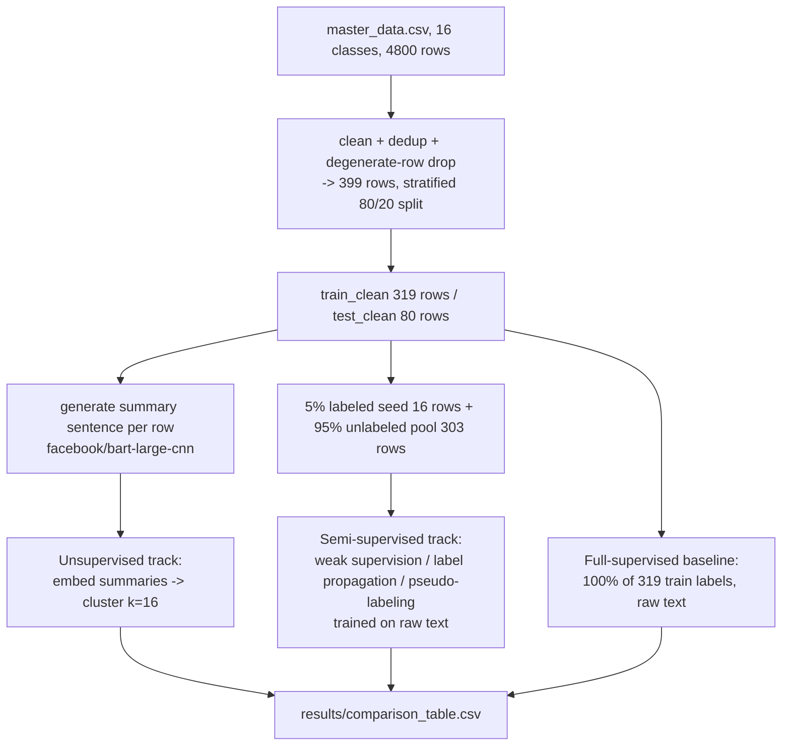
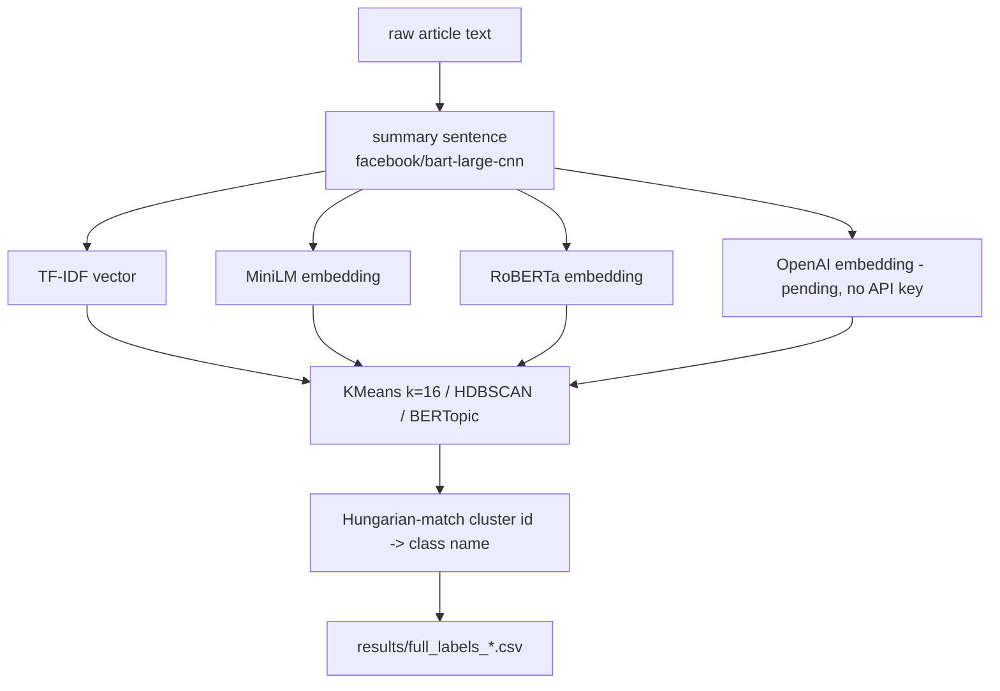
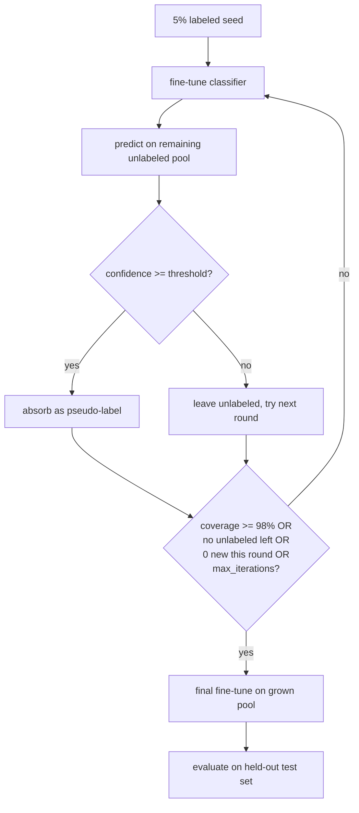

# Auto-Labeling for Text Classification — Master Data (16 Classes)

**Project summary for presentation**
Date: 2026-09-05

> The AG News (4-class) version of this project has been retired and is
> archived at [`docs/PROJECT_SUMMARY_AGNEWS_ARCHIVE.md`](docs/PROJECT_SUMMARY_AGNEWS_ARCHIVE.md)
> for historical reference. This document describes the current,
> `data/master_data.csv`-based rebuild.

## 1. Goal

Automatically assign category labels to a corpus of news/opinion articles
**without full human annotation**, and compare how far unsupervised
clustering, weak supervision, label propagation, pseudo-labeling
(self-training), and a full-supervised baseline each get toward that goal —
now across **16 overlapping categories** instead of AG News's 4 clean,
well-separated ones.

## 2. Dataset

`data/master_data.csv` — 4,800 rows (300/class), built from `data/raw/`
sources (`bbc-text.csv`, `CNN_Articels_clean` / `CNN_Articels_clean_2`,
`news-article-categories.csv`) via `notebooks/00_data_transform.ipynb`, with
columns `category, title, summary, text` (the source `summary` column is
**dropped** during cleaning — patchy/missing across source files; a fresh
`summary` is generated later by the pipeline itself, see below).

**16 classes** (alphabetical, so the label↔index mapping in `utils/config.py`
is deterministic and independent of CSV row order):

ARTS & CULTURE, BUSINESS, COMEDY, CRIME, EDUCATION, ENTERTAINMENT,
ENVIRONMENT, HEALTH, MEDIA, NEWS, POLITICS, RELIGION, SCIENCE, SPORTS,
TECH, WOMEN.

Several of these overlap in subject matter (POLITICS vs. NEWS vs. WOMEN vs.
CRIME vs. MEDIA can all plausibly describe the same story), which turns out
to matter a great deal for the semi-supervised results below.

**Cleaning**: dedup, drop degenerate rows (body under `MIN_WORDS=5`, e.g. a
body that is just `"(CNN)"`), leaving ~4,781 rows.

**Scope reductions.** This rebuild's working dataset went through three
successive size cuts, each directed by the user to keep runtime manageable
on this CPU-only machine: the full ~4,781 cleaned rows → 1,600 → 800 → a
final `MASTER_SAMPLE_SIZE=400` (stratified per class, landing at **399**
after rounding). The pipeline runs on the **full** current working set — no
per-method sampling caps — but "full" here means 399 rows, not the ~4,781
available after cleaning. This is the single biggest factor behind the
semi-supervised results in Section 5.

**Split**: stratified 80/20 train/test of the 399 rows → **319 train / 80
test**, ~20 rows per class (ENVIRONMENT has 19, everything else 20; see
`data/processed/train_clean.parquet` / `test_clean.parquet`).

**Labeled seed**: `LABEL_FRACTION=0.05` of the 319 train rows → **16 rows —
exactly 1 example per class** (`data/processed/labeled.parquet`), unlabeled
pool = the remaining **303 rows** (`data/processed/unlabeled.parquet`). At
the original planned scale (1,600 or 800 rows) a 5% seed would have been
tens of examples per class; at 399 rows it collapsed to the thinnest
possible seed. This thinness — not a bug, a direct consequence of the
scope reductions — is the central story behind the weak-supervision and
pseudo-labeling results in Section 5.

## 3. Pipeline / Data Flow

### 3.1 Overall pipeline



### 3.2 Unsupervised summary → cluster → name flow



### 3.3 Pseudo-labeling self-training loop (DistilBERT and ELECTRA-small both follow this shape)



As Section 6 shows, both models hit the `0 new this round` stop condition
on **iteration 0** every single attempt — the loop above never gets past
its first pass through the top branch for either model at this seed size.

## 4. Approaches

### 4.1 Unsupervised clustering (`01_embeddings.ipynb`, `02_unsupervised_clustering.ipynb`, `03_bertopic.ipynb`)

Every row's `text` is summarized into a real sentence (not keywords) with
`facebook/bart-large-cnn`, then that **summary** (not the raw text) is
embedded three ways — TF-IDF, MiniLM (`all-MiniLM-L6-v2`), RoBERTa — and
clustered with KMeans (k=16, matching the known class count) and HDBSCAN;
BERTopic runs its own embed+cluster+representation pipeline directly on the
summaries. Cluster ids are Hungarian-matched to the 16 class names for
accuracy scoring. A fourth embedding (OpenAI `text-embedding-3-small`) is
wired up but **pending** — no API key configured in this environment.

### 4.2 Semi-supervised (`04_weak_supervision.ipynb`, `08_label_propagation.ipynb`, `05_pseudo_labeling.ipynb`, `05b_pseudo_labeling_electra.ipynb`)

All three methods here train on **raw text**, not summaries, and all start
from the same 16-row (1/class) labeled seed:

- **Weak supervision**: unlike the AG News version (4 hand-written keyword
  lists), 16 classes — several overlapping — don't scale to hand-authoring,
  so `utils/weak_supervision.py` **auto-derives** each class's most
  TF-IDF-distinctive keywords from the seed itself (`derive_class_keywords`)
  and turns each into a Snorkel `LabelingFunction`; a `LabelModel` combines
  the per-class votes into one weak label per unlabeled row.
- **Label propagation**: a MiniLM k-NN graph over all 319 train rows, with
  `sklearn.semi_supervised.LabelSpreading` propagating the 16-row seed's
  labels through the graph algebraically — no fine-tuning loop.
- **Pseudo-labeling / self-training**: DistilBERT and ELECTRA-small each
  fine-tune on the growing labeled set, predict on the remaining pool, and
  absorb any prediction above a confidence threshold, repeating until a
  stop condition fires (see the loop diagram above).

### 4.3 Full-supervised baseline (`06_full_supervised_baseline.ipynb`, `06b_full_supervised_baseline_electra.ipynb`)

DistilBERT and ELECTRA-small each fine-tuned on **100%** of the 319 train
rows' true labels (not the thin 16-row seed), evaluated on the 80-row
held-out test set — the ceiling the semi-supervised methods are compared
against.

## 5. Results

### 5.1 Unsupervised clustering (k=16, on generated summaries)

| Method | ACC (Hungarian) | Macro F1 | NMI | ARI | Silhouette | Coverage |
|---|---|---|---|---|---|---|
| **minilm_kmeans** | **0.4796** | **0.4713** | 0.5149 | 0.2794 | 0.5220 | 1.00 |
| bertopic | 0.4684 | 0.2336 | 0.5676 | 0.3340 | 0.0868 | 0.4953 |
| roberta_kmeans | 0.3197 | 0.3087 | 0.3593 | 0.1410 | 0.5557 | 1.00 |
| tfidf_kmeans | 0.2571 | 0.2547 | 0.2731 | 0.0640 | 0.4259 | 1.00 |
| tfidf_hdbscan | 0.0 | 0.0 | 0.0 | 0.0 | — | 0.0 |
| minilm_hdbscan | 0.0 | 0.0 | 0.0 | 0.0 | — | 0.0 |
| roberta_hdbscan | 0.0 | 0.0 | 0.0 | 0.0 | — | 0.0 |
| openai_kmeans | pending (no API key) | | | | | |
| openai_hdbscan | pending (no API key) | | | | | |

`minilm_kmeans` is the best unsupervised method (ACC 48.0%). `bertopic`
looks competitive on ACC (46.8%) but that number is computed only over the
~50% of rows it actually clustered — `full_labels_bertopic.csv` shows
BERTopic found only **6 non-noise topics out of 16**, with 161 of 319 rows
(50.5%) falling into the noise topic (label `ABSTAIN` in the output), a
direct consequence of running BERTopic's density-based topic model on a
399-row corpus where several of the 16 true classes have too few
documents to form their own density peak.

All three **HDBSCAN** variants degenerate to 100% noise / 0 coverage: their
`min_cluster_size=50` exceeds the ~20-row size of a typical true cluster at
this scale. This is an expected consequence of the small dataset, not a
bug — HDBSCAN was tuned for a much larger corpus.

### 5.2 Semi-supervised and supervised (raw text)

| Method | Label Accuracy | Label Macro F1 | Test Accuracy | Test Macro F1 | Coverage |
|---|---|---|---|---|---|
| **full_supervised** (DistilBERT, 100% labels) | — | — | **0.6125** | **0.5924** | — |
| label_propagation | 0.3531 | 0.3362 | — | — | 1.00 |
| pseudo_labeling (DistilBERT) | — | — | 0.1250 | 0.0630 | 0.00 |
| full_supervised_electra (ELECTRA-small, 100% labels) | — | — | 0.0750 | 0.0218 | — |
| pseudo_labeling_electra (ELECTRA-small) | — | — | 0.0625 | 0.0247 | 0.00 |
| weak_supervision | 0.0627 | 0.0075 | — | — | 1.00 |

(16-class chance baseline ≈ 6.25%.)

**Label propagation** (35.3% label accuracy, Macro F1 0.336) is by far the
strongest semi-supervised method here — meaningfully above chance despite
the 1-example-per-class seed, because MiniLM embedding-similarity
propagation is far more robust to a thin seed than keyword matching or
self-training confidence thresholds.

**Weak supervision** lands at 6.27% label accuracy / 0.0075 Macro F1 —
**exactly the 16-class chance baseline (6.25%)**. Root cause: deriving
"class-distinctive" keywords from a single document per class picks up that
one document's idiosyncrasies, not real class signal — there is no way for
a TF-IDF-distinctiveness score computed over one example to generalize.

**Pseudo-labeling / self-training** for both models **stalled completely at
round 0** — see Section 6. Both finish with 0% coverage beyond the
original seed and near- or at-chance test accuracy (DistilBERT 12.5%,
ELECTRA-small 6.25% — exact chance).

**Full-supervised baseline** (trained on the whole 319-row train set, not
the 16-row seed): DistilBERT reaches 61.25% test accuracy / 0.592 Macro F1
— reasonable given only ~20 examples/class. ELECTRA-small reaches only
7.5% (near chance), consistent with ELECTRA-small's known
randomly-initialized classification head needing more data/epochs to
converge than DistilBERT's — the same pattern seen in the archived AG News
project.

## 6. Per-Loop Results — Pseudo-Labeling (Self-Training)

This is the most important semi-supervised finding of this rebuild: **a
1-example-per-class seed cannot support self-training at all.** Unlike the
archived AG News document's tuning story — which had a real multi-round
curve (331 → 43 → 12 pseudo-labels absorbed across 3 rounds) because its
seed was thousands of rows — both models here stall at **iteration 0**
every single attempt, with 0 new pseudo-labels absorbed regardless of how
low the confidence threshold is set. The per-round table below is
therefore a single row per model, and that single stalled row **is** the
finding.

### 6.1 DistilBERT (`05_pseudo_labeling.ipynb`)

Confidence thresholds tried during tuning: 0.80, 0.50, 0.35, 0.25 — every
one absorbed exactly 0 new pseudo-labels. Final reported threshold: **0.50**
(arbitrary among identical-result attempts, since threshold had no effect
on the outcome).

| Round | New pseudo-labels absorbed | Cumulative coverage |
|---|---|---|
| 0 | 0 | 5.0% (16/319, seed only) |

Loop stopped at iteration 0 (`0 new this round`). Final test accuracy:
12.5% / Macro F1 0.063.

### 6.2 ELECTRA-small (`05b_pseudo_labeling_electra.ipynb`)

Confidence thresholds tried during tuning: 0.50, 0.35 — every one absorbed
exactly 0 new pseudo-labels. Final reported threshold: **0.35** (again
arbitrary among identical-result attempts).

| Round | New pseudo-labels absorbed | Cumulative coverage |
|---|---|---|
| 0 | 0 | 5.0% (16/319, seed only) |

Loop stopped at iteration 0. Final test accuracy: 6.25% (exact chance) /
Macro F1 0.025.

**Why this happened**: with only 1 labeled example per class, the round-0
fine-tuned classifier has no way to become confident about *any* class —
its softmax outputs stay near-uniform across 16 classes, and even a very
low confidence threshold (0.25–0.35) can't clear a distribution that flat
for enough of the pool to matter. This contrasts sharply with the tuning
story in the archived AG News document, whose thousands-of-rows seed gave
its round-0 classifier real signal to build confident predictions from.

## 7. Sample Generated Labels

### 7.1 Unsupervised (`minilm_kmeans`, real rows with generated summary)

| Text (truncated) | Generated summary (truncated) | Predicted | True |
|---|---|---|---|
| Hackers Breach Computer Networks Of Some Big U.S. Law Firms... | Hackers Breach Computer Networks Of Some Big U.S. Law Firms: Report. Federal investigators are looking to see if confidential information was stolen... | TECH | TECH |
| Pope Francis, In Easter Address, Says 'Defenseless' Being Killed... | Pope Francis calls for peace in the Holy Land two days after 15 Palestinians were killed on the Israeli-Gaza border... | POLITICS | RELIGION |
| FBI to meet with Florida officials on election hacking... | FBI officials are set to meet with Florida Gov. Ron DeSantis and US Sen. Rick Scott about concerns that Russians hacked at least one Florida county... | TECH | POLITICS |
| Google Features 12 Female Artists To Celebrate International Women's Day... | Google Features 12 Female Artists To Celebrate International Women's Day. Each illustration features a personal story... | ARTS & CULTURE | WOMEN |

(Full 319 rows: `results/full_labels_minilm_kmeans.csv`.)

### 7.2 Full-supervised (DistilBERT, `results/sample_labels_full_supervised.csv`)

| Text (truncated) | Predicted | True | Correct |
|---|---|---|---|
| At Tribeca: Wondrous Boccaccio... | ARTS & CULTURE | ARTS & CULTURE | True |
| Another Gun Just Went Off In A School... | CRIME | CRIME | True |
| Boris Johnson is spoiling for a fight - CNN... | NEWS | NEWS | True |
| Former Playboy Model Accuses Oliver Stone Of Groping Her Breast... | MEDIA | WOMEN | False |
| Are You A Gamer Who's The Victim Of A Harassment Campaign?... | TECH | WOMEN | False |

### 7.3 Label propagation (`results/sample_labels_label_propagation.csv`)

| Text (truncated) | Predicted | True | Correct | Confidence |
|---|---|---|---|---|
| Colbert Exposes The Biggest Flaw In Trump's Latest Conspiracy Theory... | COMEDY | COMEDY | True | 0.958 |
| Pfizer says its vaccine is 90.7% effective... | HEALTH | HEALTH | True | 0.917 |
| Richard Branson: All cars will be electric by 2030... | BUSINESS | SPORTS | False | 0.592 |
| Don't Tell Model Winnie Harlow She's 'Suffering' From Vitiligo... | ARTS & CULTURE | WOMEN | False | 0.642 |

### 7.4 Weak supervision (`results/sample_labels_weak_supervision.csv`)

| Text (truncated) | Predicted | True | Correct | Confidence |
|---|---|---|---|---|
| Animal Photos Of The Week: Monkeys, Giraffes, Pandas... | ARTS & CULTURE | ENVIRONMENT | False | 0.081 |
| Stephen Colbert Mocks Proposal To Hang Trump And Pence Portraits... | CRIME | COMEDY | False | 0.101 |
| Sarah Silverman's 'SNL' Promos Are Adorable... | WOMEN | COMEDY | False | 0.075 |

All five sampled rows in this method's qualitative table are incorrect —
consistent with its 6.27% (chance-level) label accuracy in Section 5.2.

### 7.5 Pseudo-labeling test set (`results/sample_labels_pseudo_labeling_test.csv`)

| Text (truncated) | Predicted | True | Correct |
|---|---|---|---|
| Unarmed Hotel Security Guard Who Found Las Vegas Shooter Hailed As Hero... | CRIME | CRIME | True |
| Uses For Dental Floss: 12 Quick Tricks Around The House... | HEALTH | ENVIRONMENT | False |
| 'Pokémon Go' Just Added Billions Of Dollars To Nintendo's Value... | WOMEN | TECH | False |

These predictions come purely from the round-0 fine-tune on the 16-row
seed (no pseudo-labels were ever absorbed into training) — see Section 6.

## 8. Full-Output CSV Convention

Every method in this pipeline saves two artifacts to `results/`:

- **`sample_labels_<method>.csv`** — a small qualitative sample (roughly one
  row per class) for quick human eyeballing.
- **`full_labels_<method>.csv`** — every row the method scored, columns
  `text, summary, predicted_label, true_label[, confidence]` (unsupervised
  methods carry `summary` instead of `confidence`; pseudo-labeling saves
  separate `_train_pool` and `_test` variants since it labels both).

`results/metrics_<method>.json` carries that method's numeric metrics (and,
for pseudo-labeling, the per-round `history` list transcribed in Section 6).
`results/comparison_table.csv` aggregates every method's headline metrics
into one row-per-method table (Section 5's tables are pulled directly from
it).

## 9. Limitations / Next Steps

- **k=16 assumed, not swept.** Every KMeans run above fixes `k=16` because
  that's the known class count — a real deployment without ground truth
  would need to **sweep k** and choose it by an unsupervised metric (e.g.
  silhouette) rather than assuming it. Deferred to future work, as in the
  archived AG News document.
- **Labeled-seed thinness (new to this run).** The three successive scope
  reductions (4,781 → 1,600 → 800 → 399 rows) shrank the 5% labeled seed to
  exactly 1 example per class — far thinner than originally planned at any
  of the earlier candidate sizes. This is directly responsible for weak
  supervision collapsing to chance and pseudo-labeling stalling at round 0
  for both models (Sections 5.2, 6). **A future run at a less aggressively
  capped seed size (e.g. the 800-row or full ~4,781-row scope) would be
  needed to actually observe pseudo-labeling and weak-supervision dynamics
  on this 16-class dataset** — the current results demonstrate the failure
  mode of an extremely thin seed, not the ceiling of either method.
- **BERTopic's noise-topic coverage (~50%) is a small-corpus limitation.**
  At 399 rows for 16 classes, several classes don't have enough documents
  to form their own density peak; BERTopic found only 6 of 16 topics as a
  result. A larger corpus (see above) would likely resolve this too.
- **HDBSCAN's fixed `min_cluster_size=50`** exceeds the ~20-row true
  cluster size at this scale for all three embeddings, degenerating to
  100% noise. Would need retuning (or a data-size-aware default) to be
  useful on a corpus this small.
- **OpenAI embeddings are pending** — `openai_kmeans` / `openai_hdbscan` are
  wired up in the pipeline but not run in this environment (no API key
  configured).
- **Semantic-closeness scoring** (comparing a generated free-text label to
  the true class name by embedding similarity, rather than only exact
  match) remains a deferred future item, as noted in the archived AG News
  document — every method here still outputs one of the 16 fixed class
  names, so exact-match accuracy stays well-defined for now.

## 10. Repo Map

```
data/
  master_data.csv          # 16-class dataset, 4800 rows (300/class)
  raw/                      # source files feeding 00_data_transform.ipynb
  processed/
    train_clean.parquet     # 319 rows, cleaned + summary column
    test_clean.parquet      # 80 rows
    labeled.parquet         # 16-row (1/class) labeled seed
    unlabeled.parquet       # 303-row unlabeled pool
    _summary_cache.json     # durable content-keyed summary cache, never delete

notebooks/
  00_data_transform.ipynb          # raw sources -> master_data.csv
  01_embeddings.ipynb               # TF-IDF/MiniLM/RoBERTa/OpenAI embeddings, cached
  02_unsupervised_clustering.ipynb  # KMeans(k=16)/HDBSCAN over each embedding
  03_bertopic.ipynb                 # BERTopic topic modeling
  04_weak_supervision.ipynb         # auto-derived Snorkel labeling functions
  05_pseudo_labeling.ipynb          # DistilBERT self-training loop
  05b_pseudo_labeling_electra.ipynb # ELECTRA-small self-training loop
  06_full_supervised_baseline.ipynb        # DistilBERT, 100% train labels
  06b_full_supervised_baseline_electra.ipynb # ELECTRA-small, 100% train labels
  07_comparison.ipynb               # aggregates results/comparison_table.csv
  08_label_propagation.ipynb        # MiniLM k-NN graph + LabelSpreading

utils/
  config.py             # paths, class names, seed, sample-size knobs
  data.py               # loading/cleaning/splitting
  embeddings.py         # TF-IDF/MiniLM/RoBERTa/OpenAI embedding helpers
  summarization.py      # bart-large-cnn summarize/title generation only
                         # (zero-shot classification pieces removed with
                         # the AG News-era summarization_labeling notebook)
  weak_supervision.py   # auto-derived per-class TF-IDF labeling functions
  label_propagation.py  # k-NN graph + LabelSpreading
  modeling.py           # fine-tuning helpers (DistilBERT/ELECTRA-small)
  interpretability.py   # cluster-term extraction (KeyBERT-based)
  metrics.py            # shared metric computation
  samples.py            # sample/full-label CSV writers

results/
  comparison_table.csv           # one row per method, all headline metrics
  metrics_<method>.json          # per-method metrics (+ history for pseudo-labeling)
  sample_labels_<method>.csv     # small qualitative sample
  full_labels_<method>.csv       # every row scored by that method
  confusion_matrix_<method>.png  # supervised/pseudo-labeling confusion matrices
  comparison_bar_chart.png       # visual summary across methods

docs/
  PROJECT_SUMMARY_AGNEWS_ARCHIVE.md  # retired AG News (4-class) version
  semi_supervised_methods.md         # candidate/decision log for semi-supervised methods
```
